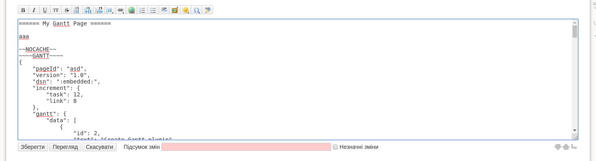
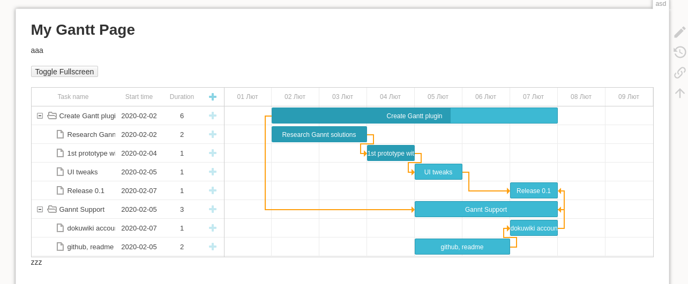
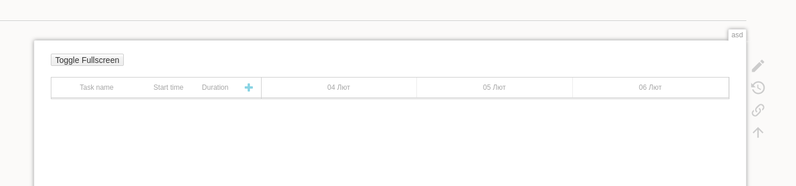
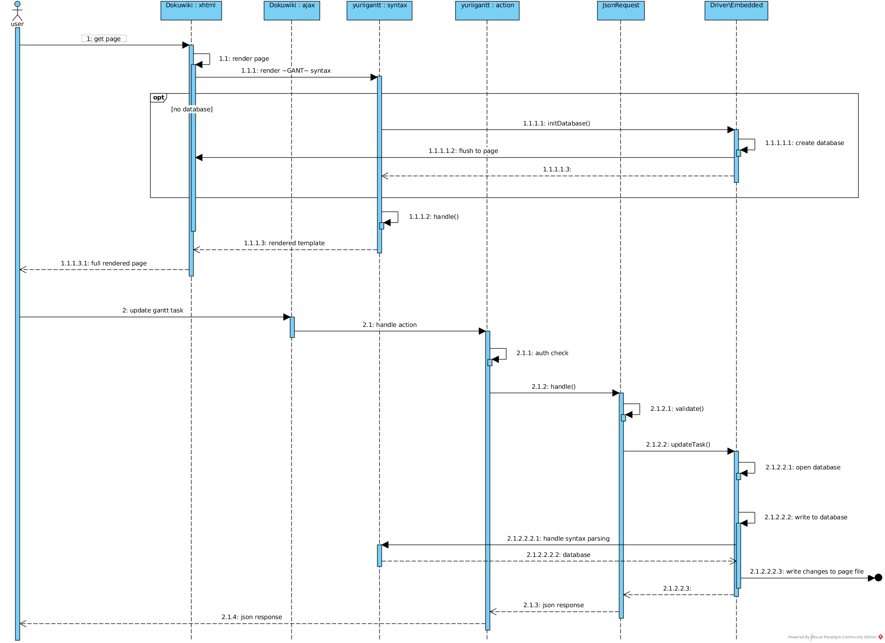

# Yurii's Gantt Plugin

[](https://travis-ci.org/yurii-github/dokuwiki-plugin-yuriigantt)

[Plugin page at Official](https://www.dokuwiki.org/plugin:yuriigantt)
[My user at Official](https://forum.dokuwiki.org/user/50392)

This plugin allow you to add Gantt table into Dokuwiki page.




In nutshell, it just wraps [dhtmlxGantt](https://dhtmlx.com/docs/products/dhtmlxGantt).
To use dhtmlxGantt in non-GPL projects (and get Pro version of the product), please obtain Commercial/Enterprise or Ultimate license on their site https://dhtmlx.com/docs/products/dhtmlxGantt/#licensing or contact them at sales@dhtmlx.com
Replace installation code at *lib/plugins/yuriigantt/3rd/dhtmlxgantt* with your dhtmlxGantt PRO.

p.s. This plugin is shipped with dhtmlxGantt Standard v.6.3.5

## Installation

1. automatic TODO
1. manual
    ```
    cd YOUR_DOKUWIKI_DIR/lib/plugins
    git clone --single-branch --branch master https://github.com/yurii-github/dokuwiki-plugin-yuriigantt.git yuriigantt
    ```

## Usage

1. create/request new dokuwiki page from your browser
1. add the least required syntax into the page
    ```
    ~~NOCACHE~~
    ~~~~GANTT~~~~

    ~~~~~~~~~~~
    ```
1. save. you must see now 
1. (Optional) Click page edit. You will see that data for empty embedded database was initialized
    ```
    ~~NOCACHE~~
    ~~~~GANTT~~~~
    {
        "pageId": "asd",
        "version": "1.0",
        "dsn": ":embedded:",
        "increment": {
            "task": 1,
            "link": 1
        },
        "gantt": {
            "data": [],
            "links": []
        }
    }
    ~~~~~~~~~~~
    ```
You can also try [this demo example](_test/test_page.txt) instead.

## How It Works

NOTE! Currently only embedded database driver is supported



### Drivers
#### Embedded
Info about gantt database is stored in page within special pattern in JSON format.
Embedded database also stores its data near database info.
```
~~~~GANTT~~~~
{
    "pageId": "asd", <--- page identifier
    "version": "1.0", <-- RESERVED version idetificator
    "dsn": ":embedded:", <-- says parser what database driver was used
    "increment": { <--- EMBEDDED table increments
        "task": 12,
        "link": 8
    },
    "gantt": { <----- EMBEDDED table data
~~~~~~~~~~~
```
On each user update dokuwiki file is parsed, database extracted, its data get changes and with new changes database is stored back to dokuwiki file.


**NOTE! If you have file with size more than 10k bytes, please consider to use other drivers!**

## For Developer

If you change syntax parser, to refresh rendered page cache please run page with purge
```
http://127.0.0.1:8000/doku.php?id={PAGEID}&purge=true
```

#### DXHTML

* https://docs.dhtmlx.com/gantt/samples

